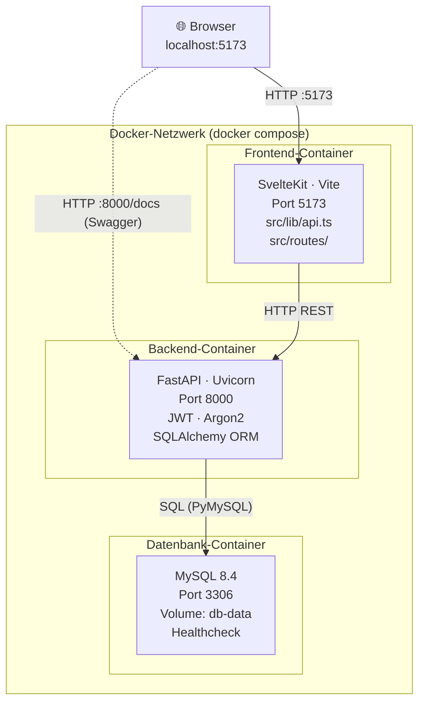

# Recipe Manager – Deine kollaborative Rezept-Plattform

Diese Plattform ermöglicht es Nutzern, ihre Lieblingsrezepte zentral zu speichern, zu verwalten und mit anderen Hobby-Köchen zu teilen. Oft verliert man den Überblick über gute Rezepte oder sucht ewig nach Inspiration für bestimmte Zutaten. Der Recipe Manager löst dieses Problem durch ein intelligentes Tagging-System und eine performante Suchfunktion, mit der man genau das Gericht findet, auf das man gerade Lust hat.

##  Kernfunktionen
* **Benutzerverwaltung & Sicherheit:** Sichere Registrierung und Authentifizierung via JWT-Tokens und Argon2-Passwort-Hashing.
* **Rezeptverwaltung:** Erstellen, Bearbeiten und Löschen von Rezepten inkl. Zutaten, Zubereitungsschritten, Zeit- und Schwierigkeitsangaben.
* **Sichtbarkeitssteuerung:** Rezepte können als `privat` (nur für den Ersteller) oder `öffentlich` markiert werden.
* **Tagging-System:** Flexible Kategorisierung von Rezepten durch m:n-Beziehungen - ein Rezept kann beliebig viele Tags haben.
* **Erweiterte Suche:** Filtern von Rezepten nach Text in Titeln sowie den Rezeptbeschreibung sowie die möglichkeit von kombinierten Tag-IDs.
* **Community-Feedback:** Integriertes 5-Sterne-Bewertungssystem für öffentliche Rezepte.

---

## Architektur & Technologie-Stack

Die Anwendung folgt einer modernen Microservice-Architektur und wird vollständig über Docker Compose orchestriert.

* **Frontend:** SvelteKit
* **Backend:** FastAPI (Python) mit Pydantic und SQLAlchemy
* **Datenbank:** MySQL 8.4
* **Deployment:** Docker & Docker Compose

### Architekturdiagramm:



## Arbeitsaufteilung
Fehlt noch

## Quickstart

docker compose up -d --build


## Projektstruktur
noch Anpassen
```
projekt-template/
├── backend/
│   ├── main.py          # FastAPI-App (Endpoints)
│   ├── auth.py          # JWT + Argon2 Passwort-Hashing
│   ├── database.py      # SQLAlchemy Engine + Session
│   ├── models.py        # ORM-Modelle (User + eure Tabellen)
│   ├── schemas.py       # Pydantic-Schemas (Request/Response)
│   ├── requirements.txt # Python-Abhängigkeiten
│   └── Dockerfile       # Bauanleitung für Backend-Container
├── frontend/
│   ├── src/
│   │   ├── lib/api.ts          # API-Hilfsfunktionen (login, fetch...)
│   │   └── routes/+page.svelte # Startseite
│   ├── package.json            # NodeJS-Abhängigkeiten
│   └── Dockerfile              # Bauanleitung für Frontend-Container
├── docker-compose.yml          # Orchestrierung aller Container
├── .env.example                # Vorlage für Umgebungsvariablen
└── .gitignore                  # Git-Ignore-Datei
```


