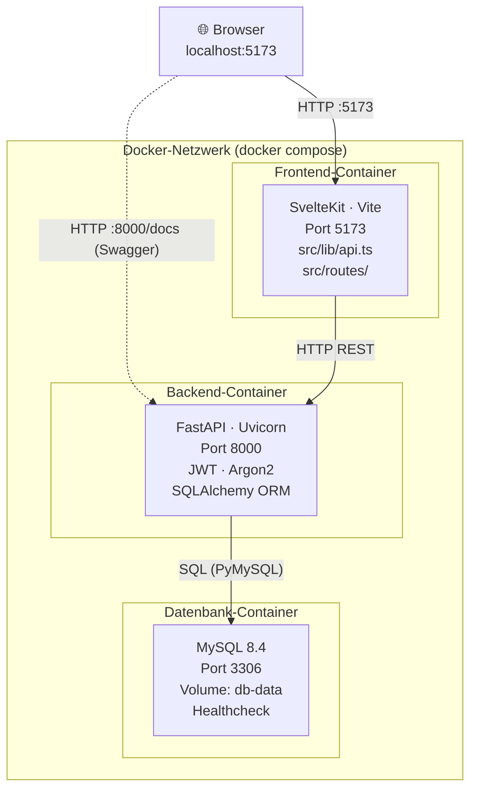

# Recipe Manager – Deine kollaborative Rezept-Plattform

Diese Plattform ermöglicht es Nutzern, ihre Lieblingsrezepte zentral zu speichern, zu verwalten und mit anderen Hobby-Köchen zu teilen. Oft verliert man den Überblick über gute Rezepte oder sucht ewig nach Inspiration für bestimmte Zutaten. Der Recipe Manager löst dieses Problem durch ein intelligentes Tagging-System und eine performante Suchfunktion, mit der man genau das Gericht findet, auf das man gerade Lust hat.

##  Kernfunktionen
* **Benutzerverwaltung & Sicherheit:** Sichere Registrierung und Authentifizierung via JWT-Tokens und Argon2-Passwort-Hashing.
* **Rezeptverwaltung:** Erstellen, Bearbeiten und Löschen von Rezepten inkl. Zutaten, Zubereitungsschritten, Zeit- und Schwierigkeitsangaben.
* **Sichtbarkeitssteuerung:** Rezepte können als `privat` (nur für den Ersteller) oder `öffentlich` markiert werden.
* **Tagging-System:** Flexible Kategorisierung von Rezepten durch m:n-Beziehungen - ein Rezept kann beliebig viele Tags haben.
* **Erweiterte Suche:** Filtern von Rezepten nach Text in Titeln sowie den Rezeptbeschreibung sowie die möglichkeit von kombinierten Tag-IDs.
* **Community-Feedback:** Integriertes 5-Sterne-Bewertungssystem für öffentliche Rezepte.

---

## Architektur & Technologie-Stack

Die Anwendung folgt einer modernen Microservice-Architektur und wird vollständig über Docker Compose orchestriert.

* **Frontend:** SvelteKit
* **Backend:** FastAPI (Python) mit Pydantic und SQLAlchemy
* **Datenbank:** MySQL 8.4
* **Deployment:** Docker & Docker Compose

### Architekturdiagramm:


### Projektstruktur
```
smartcookies/
├── docker-compose.yml          # Orchestrierung aller 3 Container
├── .env.example                # Vorlage für Umgebungsvariablen
├── .gitignore
│
├── backend/
│   ├── Dockerfile              # Bauanleitung Backend-Container
│   ├── requirements.txt        # Python-Abhängigkeiten (FastAPI, SQLAlchemy, …)
│   ├── main.py                 # FastAPI-App & alle API-Endpunkte
│   ├── auth.py                 # JWT-Erstellung & Validierung, Argon2-Hashing
│   ├── database.py             # SQLAlchemy Engine, Session, Base
│   ├── models.py               # ORM-Modelle: User, Recipe, Tag, Rating, recipe_tags
│   └── schemas.py              # Pydantic-Schemas für Request & Response
│
└── frontend/
    ├── Dockerfile              # Bauanleitung Frontend-Container
    ├── package.json            # Node.js-Abhängigkeiten (SvelteKit, Vite, …)
    ├── svelte.config.js        # SvelteKit-Konfiguration (Adapter, Runes-Mode)
    ├── vite.config.ts          # Vite-Konfiguration
    ├── tsconfig.json           # TypeScript-Konfiguration
    └── src/
        ├── app.html            # HTML-Shell (SvelteKit-Einstiegspunkt)
        ├── app.d.ts            # TypeScript-Typen für SvelteKit
        ├── lib/
        │   └── api.ts          # Alle API-Hilfsfunktionen (login, register, fetch…)
        └── routes/
            ├── +layout.svelte              # Globales Layout (alle Seiten)
            ├── +page.svelte                # / → Startseite (Landingpage)
            ├── login/
            │   └── +page.svelte            # /login → Login-Seite
            ├── register/
            │   └── +page.svelte            # /register → Registrierung
            └── recipes/
                ├── +page.svelte            # /recipes → Übersicht & Suche
                ├── new/
                │   └── +page.svelte        # /recipes/create → Rezept erstellen
                └── [id]/
                    |── +page.svelte        # /recipes/[id] → Detailansicht
                    └── edit/
                        └── +page.svelte    # /recipes/[id]/edit → Rezept bearbeiten
```
## Quickstart
* Startbefehl: `docker compose up -d --build`
* Stoppbefehl: `docker compose down`

### Erreichbarkeiten im Browser 
* Forontend: `http://localhost:5173`
* Backende: `http://localhost:8000/docs`

## Arbeitsnachweis – Aufgabenverteilung

| Teammitglied    | Bereich              | Aufgaben                                                                 |
|-----------------|----------------------|--------------------------------------------------------------------------|
| Michèle Plocher | Frontend             | SvelteKit – alle Seiten & Komponenten, UI-Design & Styling, Routing & Navigation, Formulare (Login, Register, Rezept erstellen), Rezeptübersicht & Detailansicht |
| Melissa Kindler | Backend, Auth, Testing | FastAPI-Backend – Aufbau & Struktur, JWT-Authentifizierung & Argon2-Hashing, API und Frontend-Verknüpfung, Fehlerbehandlung & Fehlerbehebung, Testing |
| Rahel Stein     | Datenbank, Backend  | Datenbankmodell & SQLAlchemy-Modelle, MySQL-Schema & Beziehungen, m:n Tagging-System (recipe_tags), Backend-Endpoints (Rezepte, Tags, Ratings)|
| Philipp Här     | Doku, Testing  | README – Aufbau & Dokumentation, Architekturdiagramm (Mermaid), Testing |


